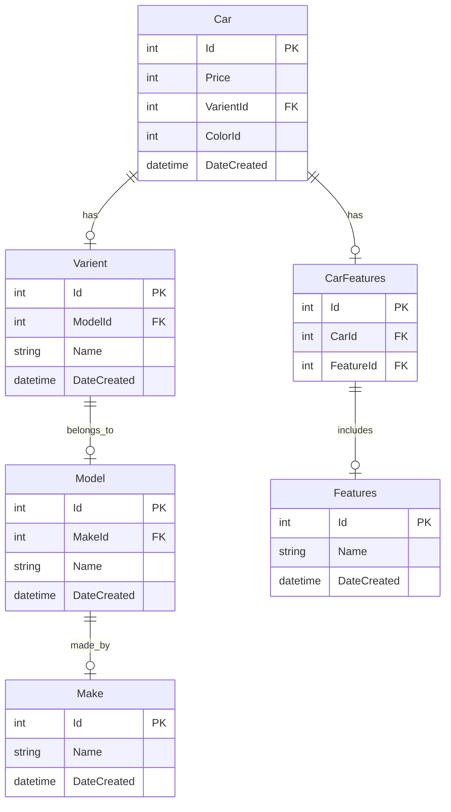

+++
title = "🏎️ Building pre-owned Car Platform With Valkey Part 2"
description = ""
date = 2024-07-17T19:54:52+05:30
lastmod = 2024-07-17T19:54:52+05:30
publishDate = "2024-07-17T19:54:52+05:30"
draft = true
tags = []
images = []
+++

In [Part 1](/posts/building-blazingly-fast-pre-owned-car-platform-with-valkey-part-1) of our series, we explored the foundational aspects of our platform's performance optimization. We began by defining our business model, which combines a marketplace and inventory system to facilitate car sales. We detailed the user flow, including how users view ads, generate leads, and book test drives. Our primary focus was on enhancing the performance of _individual car pages_, where we discussed various strategies to reduce latency and improve load times. We examined the impact of client-side versus server-side rendering and outlined initial approaches to optimizing both frontend and backend components.

In Part 2, we will focus on building and optimizing the listing page using Valkey. We will explore how to handle complex filters, manage pagination efficiently, and ensure the listing page loads quickly to provide an excellent user experience.

We will review the existing design and discuss how we mapped our business use cases to Valkey to significantly reduce response times. This will include an exploration of how to handle complex filters, manage pagination effectively, and leverage Valkey's capabilities to ensure that the listing page delivers a fast and seamless user experience.

# What ?

Listing Page - A catalog of cars with basic information and filter or order list of cars.

# Why ?

As we discussed in part-1, ~40-60% ads leads to listing page which shows list of cars. So we want to reduce page load time to reduce bounce rate.

# Specification

- Filters
- Pagination
- Recommendation Model

# Filters

In any ecommerece site, you have ability to filter the listing to narrow down what you are looking for. Here lets review how this works behind the scene using database.

## Database

### Schema



Car

| id  | price  | varient_id | color_id | date_created     |
| --- | ------ | ---------- | -------- | ---------------- |
| 1   | 775000 | 123        | 1        | 2020-07-20 02:17 |

Varient

| id  | model_id | name | date_created     |
| --- | -------- | ---- | ---------------- |
| 123 | 100      | XM   | 2020-07-20 02:17 |

Model

| id  | make_id | name  | date_created     |
| --- | ------- | ----- | ---------------- |
| 100 | 10      | Nexon | 2020-07-20 02:17 |

Make

| id  | name | date_created     |
| --- | ---- | ---------------- |
| 10  | Tata | 2020-07-20 02:17 |

Features

| id  | name | date_created     |
| --- | ---- | ---------------- |
| 20  | AMT  | 2020-07-20 02:17 |

CarFeatures

| id  | car_id | feature_id |
| --- | ------ | ---------- |
| 1   | 1      | 20         |





Note, this isn't a complete schema. Here, we need to show one example of a 1xN and an NxM data relation involving the Car table.

### Backend

In the backend, we are using [Django](https://www.djangoproject.com/) and [Django REST Framework](https://www.django-rest-framework.org/) to create REST APIs, alongside the [django-filter](https://django-filter.readthedocs.io/en/stable/guide/usage.html) library to easily add complex filters.

```py
from django_filters import rest_framework as filters

class CarFilterSet(filters.FilterSet):
    """Custom filter class for filtering user, you can add different filter attributes later"""
    city_id = filter.NumberFilter(name="locality__city__id", field_name="city_id", lookup_expr="in")
    price_min = django_filters.NumberFilter(name='price', lookup_expr='gte')
    price_max = django_filters.NumberFilter(name='price', lookup_expr='lte')
    make = django_filters.NumberFilter(name="varient__model__make__id", lookup_expr="in")
    model = django_filters.NumberFilter(name="varient__model__id", lookup_expr="in")
    color = django_filter.NumberFilter(name="color__id", lookup_expr="in")
    features = filter.NumberFilter(name='features__id', lookup_expr='in')
    slug = filter.SlugFilter()

    class Meta:
        model = Car
        fields = [
            "make",
            "model",
            "year",
            "color",
            "price",
            "slug"
        ]
```

In views.py, this gets executed with each request where internally django will apply the filters to the queryset, paginate and serialize the objects into JSON response.

```py
from rest_framework import viewsets, mixins
from rest_framework.filters import OrderingFilter
from django_filters.rest_framework import DjangoFilterBackend
from .filters import CarFilterSet

class CarViewSet(viewsets.GenericViewSet, mixins.ListModelMixin):
    """
    A viewset that provides the standard actions for the User model,
    including filtering using CarFilterSet.
    """
    queryset = Car.objects.all() # django lazy queryset
    serializer_class = CarSerializer # converts django orm objects into json
    filter_backends = (DjangoFilterBackend, OrderingFilter) # django filters
    filterset_class = CarFilterSet # custom filterset
    ordering_fields = ["price", "year"]
    pagination_class = CarPagination

```

### Request

```sql
GET https://api.car.com/listing/?city_id=1&price_min=200000&price_max=400000&make_id=121,120&

SELECT ... FROM car
    LEFT JOIN locality on car.locality_id = locality.id
    LEFT JOIN city on locality.city_id = city.id
    LEFT JOIN varient on car.varient_id = varien t.id
    LEFT JOIN model on varient.model_id = model.id
    LEFT JOIN make on model.make_id = make.id
  WHERE
    city.id in (1,)
    AND car.price > 200000
    AND car.price < 400000
    AND make.id in (121, 120)
LIMIT 10 -- = page_size
OFFSET 0 -- = page_no * (page_size - 1) ; 1 <= page_no <= max_page
-- max_page = Math.ceil(count / page_size)
```

### Response

```json
HTTP 200 OK
{
  "count": 1023,
  "next": "https://api.car.com/listing/?page=3",
  "previous": "https://api.car.com/listing/?page=1",
  "results": [
    {
      "id": 1,
      "images": [
        "https://cdn.car.com/1/front.webp",
        "https://cdn.car.com/1/left.webp",
        "https://cdn.car.com/1/right.webp",
        "https://cdn.car.com/1/back.webp"
      ],
      "price": 721000,
      "model_name": "Nexon",
      "varient_name": "XM",
      "link": "/user-cars/1",
      "city_name": "Mumbai",
      "owner": "1st"
    }
    . . . = page_size cars
  ]
}
```

To improve SEO, we implemented dynamic slugs in our URLs, making them more human-friendly. For example, when someone searches for "Used Nexon car" on Google, our indexed page will already have a URL that reflects this search term. This approach enhances our search visibility and aligns our URLs with user queries, increasing the likelihood of attracting relevant traffic.

```sql
🌐 https://car.com/used-nexon-cars-in-mumbai
-- client takes path and sends as slug query param to the backend
GET https://api.car.com/listing/?slug=used-nexon-cars-in-mumbai
```

In this case, the `SlugFilter` will parse the tokens from the URL and use a database table to return the appropriate query string. For any given `SlugFilter`, a valid query string combination will always exist as it is a subset of the overall filters.

```md
user-nexon-cars-in-mumbai => model=121&city=1
```

| id  | value  | type      | filter |
| --- | ------ | --------- | ------ |
| 1   | nexon  | model     | 121    |
| 2   | mumbai | city      | 1      |
| 3   | 4-lakh | price     | 400000 |
| 4   | tata   | make      | 2      |
| 5   | petrol | fuel_type | 1      |

## ValKey

Let's go through some of the in-built data structures. We will



```markdown
SET Sets the string value of a key, ignoring its type. The key is created if it doesn't exist.
TTL Returns the expiration time in seconds of a key.

HMSET Sets the values of multiple fields.
HMGET Returns the values of all fields in a hash.
HGETALL Returns all fields and values in a hash.

SADD Adds one or more members to a set. Creates the key if it doesn't exist.
SCARD Returns the number of members in a set.
SINTER Returns the intersect of multiple sets.
SINTERSTORE Stores the intersect of multiple sets in a key.
SISMEMBER Determines whether a member belongs to a set.
SUNION Returns the union of multiple sets.
SUNIONSTORE Stores the union of multiple sets in a key.

ZADD Adds one or more members to a sorted set, or updates their scores. Creates the key if it doesn't exist.
ZCARD Returns the number of members in a sorted set.
ZCOUNT Returns the count of members in a sorted set that have scores within a range.
ZDIFFSTORE Stores the difference of multiple sorted sets in a key.
ZINTERSTORE Stores the intersect of multiple sorted sets in a key.
ZMSCORE Returns the score of one or more members in a sorted set.
ZRANGE Returns members in a sorted set within a range of indexes.
ZRANGEBYSCORE Returns members in a sorted set within a range of scores.
ZRANGESTORE Stores a range of members from sorted set in a key.
ZRANK Returns the index of a member in a sorted set ordered by ascending scores.
ZREM Removes one or more members from a sorted set. Deletes the sorted set if all members were removed.
ZSCAN Iterates over members and scores of a sorted set.
ZSCORE Returns the score of a member in a sorted set.
ZUNION Returns the union of multiple sorted sets.
ZUNIONSTORE Stores the union of multiple sorted sets in a key.
```


