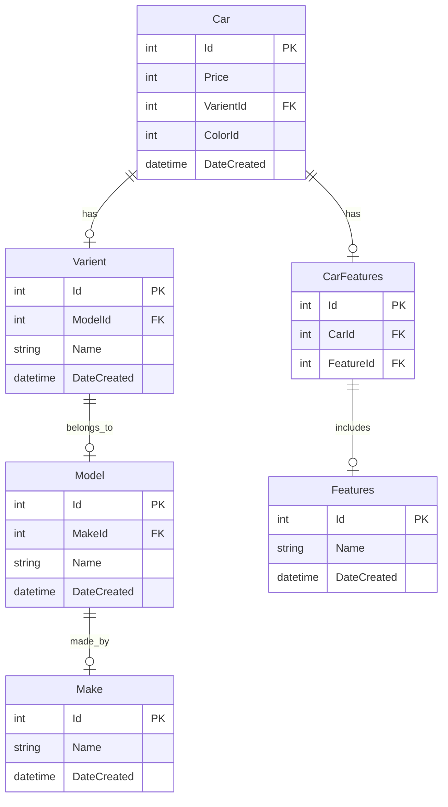
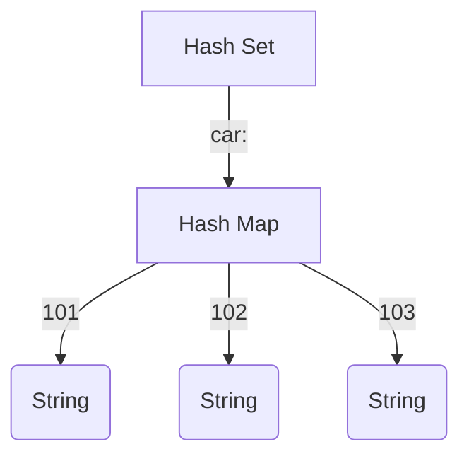
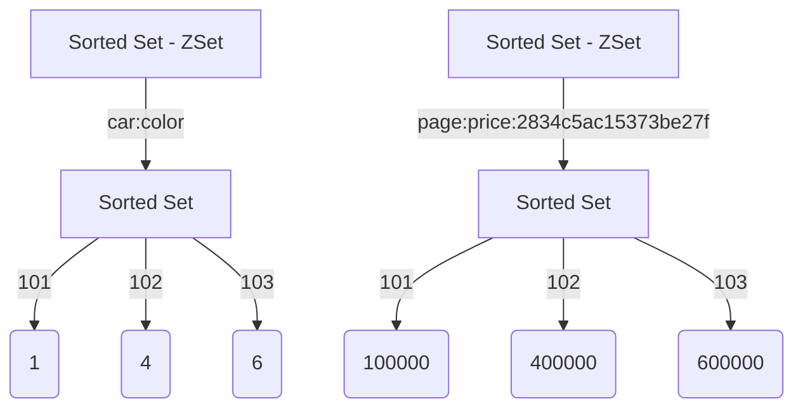
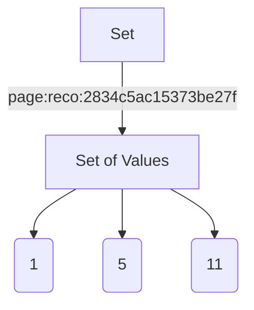

+++
title = "🏎️ Building pre-owned Car Platform With Valkey - Part 2"
description = "In Part 2, we will focus on building and optimizing the listing page using Valkey. We will explore how to handle complex filters, manage pagination efficiently, and ensure the listing page loads quickly to provide an excellent user experience."
date = 2024-07-17T19:54:52+05:30
lastmod = 2024-07-17T19:54:52+05:30
publishDate = "2024-07-17T19:54:52+05:30"
draft = false
tags = ['Django', 'Redis', 'DRF', 'CDC']
images = ["listing-viewset-list.png", "listing-viewset-detail.png", "overall-stats.png"]
featured = true
hnItemId = 41282624
theme = "coral"
+++

In [Part 1](/posts/building-blazingly-fast-pre-owned-car-platform-with-valkey-part-1) of our series, we explored the foundational aspects of our platform's performance optimization. We began by defining our business model, which combines a marketplace and inventory system to facilitate car sales. We detailed the user flow, including how users view ads, generate leads, and book test drives. Our primary focus was on enhancing the performance of _individual car pages_, where we discussed various strategies to reduce latency and improve load times. We examined the impact of client-side versus server-side rendering and outlined initial approaches to optimizing both frontend and backend components.

In Part 2, we will focus on building and optimizing the listing page using Valkey. We will explore how to handle complex filters, manage pagination efficiently, and ensure the listing page loads quickly to provide an excellent user experience.

We will review the existing design and discuss how we mapped our business use cases to Valkey to significantly reduce response times. This will include an exploration of how to handle complex filters, manage pagination effectively, and leverage Valkey's capabilities to ensure that the listing page delivers a fast and seamless user experience.

# What ?

The listing page is where users first interact with our inventory. It displays a comprehensive list of cars with basic information and provides filters and ordering options to help users refine their search effectively. Our goal is to ensure this page loads quickly and efficiently, as it plays a crucial role in reducing bounce rates.

# Why ?

As we discovered in Part 1, approximately 40-60% of user interactions begin with the listing page. Therefore, optimizing its performance can significantly improve the overall user experience, increase engagement, and ultimately drive more sales.

# Specification

To meet our users' needs, we've identified three key features for the listing page:

**Filters**: Allow users to narrow down their search by applying various filters such as make, model, year, price range, mileage, etc.

**Pagination**: Divide the extensive list of cars into manageable pages to improve load times and user experience.

**Recommendation Model**: Use a recommendation engine to order the cars based on user's browsing history or preferences.

# Filters

In a typical e-commerce site, filters help narrow down the vast inventory by applying complex queries behind the scene. Let's see how we can handle this using SQL Database.

## Database

### Schema

Car

| id  | price  | varient_id | color_id | date_created     |
| --- | ------ | ---------- | -------- | ---------------- |
| 1   | 775000 | 123        | 1        | 2020-07-20 02:17 |

Varient

| id  | model_id | name | date_created     |
| --- | -------- | ---- | ---------------- |
| 123 | 100      | XM   | 2020-07-20 02:17 |

Model

| id  | make_id | name  | date_created     |
| --- | ------- | ----- | ---------------- |
| 100 | 10      | Nexon | 2020-07-20 02:17 |

Make

| id  | name | date_created     |
| --- | ---- | ---------------- |
| 10  | Tata | 2020-07-20 02:17 |

Features

| id  | name | date_created     |
| --- | ---- | ---------------- |
| 20  | AMT  | 2020-07-20 02:17 |

CarFeatures

| id  | car_id | feature_id |
| --- | ------ | ---------- |
| 1   | 1      | 20         |



To simplify and address sufficient edge cases, we've explored a partial schema.

### Backend

In the backend, we are using [Django](https://www.djangoproject.com/) and [Django REST Framework](https://www.django-rest-framework.org/) to create REST APIs, alongside the [django-filter](https://django-filter.readthedocs.io/en/stable/guide/usage.html) library to easily add complex filters.

```py
from django_filters import rest_framework as filters

class CarFilterSet(filters.FilterSet):
    """Custom filter class for filtering cars"""
    city_id = filter.NumberFilter(name="locality__city__id", field_name="city_id", lookup_expr="in")
    price_min = django_filters.NumberFilter(name='price', lookup_expr='gte')
    price_max = django_filters.NumberFilter(name='price', lookup_expr='lte')
    make = django_filters.NumberFilter(name="varient__model__make__id", lookup_expr="in")
    model = django_filters.NumberFilter(name="varient__model__id", lookup_expr="in")
    color = django_filter.NumberFilter(name="color__id", lookup_expr="in")
    features = filter.NumberFilter(name='features__id', lookup_expr='in')
    slug = filter.SlugFilter()

    class Meta:
        model = Car
        fields = [
            "make",
            "model",
            "year",
            "color",
            "price",
            "slug"
        ]
```

When we're handling requests in Django using ViewSets (as part of Django Rest Framework), each incoming request triggers the execution of that specific ViewSet. Here's what happens under the hood with each request:

1. **Filtering**: We define filters in our serializers or viewsets, which Django Rest Framework applies to our queryset. This means only the relevant objects that match the filtering criteria are considered for further processing.

2. **Pagination**: If pagination is enabled (which it usually is), Django Rest Framework splits up the filtered queryset into smaller, paginated chunks. This helps manage large datasets and improves performance by reducing the amount of data processed at once.

3. **Serialization**: Once we have our paginated queryset, Django Rest Framework serializes these objects into JSON format. In other words, it converts our Django models or querysets into a JSON response that can be easily sent back to the client (your frontend or API consumer).

So, each time you send a request to one of your API endpoints using ViewSets, this series of operations happens behind the scenes: filtering based on defined criteria, paginating the results for efficiency, and then converting those results into JSON format for transmission.

```py
from rest_framework import viewsets, mixins
from rest_framework.filters import OrderingFilter
from django_filters.rest_framework import DjangoFilterBackend
from .filters import CarFilterSet

class CarViewSet(viewsets.GenericViewSet, mixins.ListModelMixin):
    """
    A viewset that provides the standard actions for the User model,
    including filtering using CarFilterSet.
    """
    queryset = Car.objects.all() # django lazy queryset
    serializer_class = CarSerializer # converts django orm objects into json
    filter_backends = (DjangoFilterBackend, OrderingFilter) # django filters
    filterset_class = CarFilterSet # custom filterset
    ordering_fields = ["price", "year"]
    pagination_class = CarPagination

```

### Request

```sql
GET https://api.car.com/listing/?city_id=1&price_min=200000&price_max=400000&make_id=121,120&

SELECT ... FROM car
    LEFT JOIN locality on car.locality_id = locality.id
    LEFT JOIN city on locality.city_id = city.id
    LEFT JOIN varient on car.varient_id = varien t.id
    LEFT JOIN model on varient.model_id = model.id
    LEFT JOIN make on model.make_id = make.id
  WHERE
    city.id in (1,)
    AND car.price > 200000
    AND car.price < 400000
    AND make.id in (121, 120)
LIMIT 10 -- = page_size
OFFSET 0 -- = page_no * (page_size - 1) ; 1 <= page_no <= max_page
-- max_page = Math.ceil(count / page_size)
```

### Response

```json
HTTP 200 OK
{
  "count": 1023,
  "next": "https://api.car.com/listing/?page=3",
  "previous": "https://api.car.com/listing/?page=1",
  "results": [
    {
      "id": 1,
      "images": [
        "https://cdn.car.com/1/front.webp",
        "https://cdn.car.com/1/left.webp",
        "https://cdn.car.com/1/right.webp",
        "https://cdn.car.com/1/back.webp"
      ],
      "price": 721000,
      "model_name": "Nexon",
      "varient_name": "XM",
      "link": "/user-cars/1",
      "city_name": "Mumbai",
      "owner": "1st"
    }
    . . . = page_size cars
  ]
}
```

To improve SEO performance, we've incorporated dynamic slugs into our URLs, rendering them more intuitive and user-friendly. When a user searches Google for "Used Nexon car," our indexed page's URL now mirrors this exact search query, boosting our visibility in those specific results and aligning our content with the user's intent – ultimately drawing in more relevant traffic.

```sql
🌐 https://car.com/used-nexon-cars-in-mumbai
-- client takes path and sends as slug query param to the backend
GET https://api.car.com/listing/?slug=used-nexon-cars-in-mumbai
```

In this case, the `SlugFilter` will parse the tokens from the URL and use a database table to return the appropriate query string. For any given `SlugFilter`, a valid query string combination will always exist as it is a subset of the overall filters.

```md
user-nexon-cars-in-mumbai => model=121&city=1
```

| id  | value  | type      | filter |
| --- | ------ | --------- | ------ |
| 1   | nexon  | model     | 121    |
| 2   | mumbai | city      | 1      |
| 3   | 4-lakh | price     | 400000 |
| 4   | tata   | make      | 2      |
| 5   | petrol | fuel_type | 1      |

## ValKey

We'll discuss how to efficiently store and retrieve car data in-memory, aiming to minimize round trips to ValKey[^1] while optimizing space usage.

### Why Use a Hash Set?

To swiftly serve car details displayed in list responses, we'll use a hash set. This approach offers several benefits.

**Efficient retrieval:** We can fetch data for multiple cars using `HMGET car: 101 102 103`, reducing the number of requests needed to retrieve JSON data based on page size.

**Automatic compression:** hash set provides automatic compression for data up to `hash-zipmap-max-entries`, saving memory compared to storing data in individual keys with prefixes.

**Ideal for paginated responses:** With a maximum page size of 35, we can fetch up to 35 car JSON objects via a single `HMGET` operation, optimizing data retrieval for our use case.

> the Redis setting ‘hash-zipmap-max-entries’ configures the maximum number of entries a hash can have while still being encoded efficiently. - [Instagram Blog](https://instagram-engineering.com/storing-hundreds-of-millions-of-simple-key-value-pairs-in-redis-1091ae80f74c)

#### Data Consistency and Invalidation

To maintain data consistency, we're listening to the database change log. Whenever any details affecting the response payload change, we update the relevant keys in the hash set accordingly. Additionally, when a car's status changes to a terminal state (e.g., sold or removed), we remove its key from the hash set.



### Why Use a Sorted Set?

Sorted sets offer efficient data retrieval and filtering in ValKey, making them particularly useful for tasks like pagination and attribute-based searches. Here's why:

#### Efficient Filtering with Set Theory

While we could use sorting (`SORT` command)[^2] on lists or sets to retrieve elements, it's an expensive operation with a time complexity of O(N+M\*log(M)), where:

- N is the number of elements in the list/set to sort
- M is the number of returned elements

Sorted sets allow us to efficiently filter and retrieve data based on attributes using set theory[^4] operations:

- Retrieve cars with prices between 100K INR and 500K INR:

  ```
  ZRANGEBYSCORE car:price 100000 500000
  ```

- Fetch cars with color_id = 5:

  ```
  ZRANGEBYSCORE car:color 5 5
  ```

These operations have a time complexity of O(log(N)+M), making them more efficient than sorting lists/sets. Here, N is the number of elements in the sorted set, and M is the number of returned elements.

#### Optimized Pagination with Caching

When sorting order depends on attributes like price or date_added, we can optimize subsequent requests by storing the filtered sorted list in a sorted set and using it for pagination. Here's how:

1. Store the result page in a sorted set with a key like `page:price:{queryhash}` (where `{queryhash}` is a unique identifier for the query) and an appropriate Time-To-Live (TTL).
2. Retrieve cars for the requested page using:
   - `ZRANGE` or `ZREVRANGE` to fetch elements based on their score and rank
   - `HMGET` to retrieve specific car details from a hash set like `car:`
3. Use `ZCARD` to determine the total count of cars in the result page.

This approach reduces redundant data retrieval operations, improving overall performance. Since sort order depends solely on car information, it remains consistent for any given query.



### Why Use Unordered Sets ?

When the sort order of cars depends on personalized recommendations, the order changes according to the buyer's persona every 45 minutes when we retrain our recommendation model. To optimize this dynamic ordering process:

**Calculate query hash**: We compute a unique query hash using only car-related filters as function inputs. This approach is particularly useful for popular base pages, such as cars available in Mumbai city.

**Store car IDs in an unordered set**: By using an unordered set, we disregard the order of cars at storage time. Instead, we rely on our LightFM model to calculate and apply personalized ordering in real-time from the pre-loaded model residing in the web server's memory.

This method offers several advantages:

- It **avoids storing** N possible combinations of car orders for broad queries by **merely storing** relevant car IDs.
- It **reduces storage requirements** and simplifies data management in our internal system, Valkey.
- It **enables real-time personalization** without the need to pre-compute and store multiple ordered lists, allowing for scalable and responsive serving of car listings.

This approach efficiently handles personalized recommendations while minimizing storage overhead, especially for popular, broad queries that many users might access simultaneously. By storing only the relevant car IDs in an unordered set, we rely on the web server to handle personalized ordering dynamically, creating a scalable and responsive system.



### Cache-Hit

1. Retrieve precomputed filtered car IDs from ValKey using the query string hash as the key.
2. Provide the fetched car IDs to our recommendation engine for further processing.
3. Paginate results at the application level using list comprehension to reduce data transfer and improve performance.
4. Fetch additional car details using `HMGET`, retrieving multiple hash fields efficiently.

### Cache-Miss

If the filtered car set is not cached in ValKey following query string hash calculation, perform the following steps:

1. Calculate query string hash
   - Ensure hashes are consistent regardless of filter order (e.g., `F('city_id=1&color=3,4') eq F('color=4,3&city_id=1')`).
2. Cache-Miss: Proceed to build the target car set with filters.
3. Build target car IDs using set operations:

   - Intersect existing sets using `ZINTERSTORE` to efficiently create new sets based on given filter combinations:

     ```
     ZINTERSTORE filtered_cars 2 cars_set_1 cars_set_2
     ```

   - Alternatively, combine existing sets using `ZUNIONSTORE`:

     ```
     ZUNIONSTORE all_cars 3 cars_set_1 cars_set_2 cars_set_3 AGGREGATE MAX
     ```

4. Fetch car IDs based on required order using `ZRANGEBYSCORE`.

In some cases, perform set operations at the application (web server) level to compute the resulting list of cars before fetching details with `HMGET`.

```py
def filter_by_price(redis_pipe, price_min='-inf', price_max='+inf'):
    return redis_pipe.zrangebyscore(
        name="car:price",
        min=min_value,
        max=max_value
    )
```

#### Dealing with many-to-many relationship

In case you have noticed we have Features table with MxN relationship with Cars table via CarFeatures. As one car can have many features and one feature could be there with multiple cars. How are we filtering here ?

In such cases, instead of going with `car:color` sorted set, we keep sorted set of each feature, `car:feature:{id} -> {car_id} -> 1`

Now we can use intersection and union on these sets to compute the filter.

#### Reducing network round trips

Valkey pipelining[^3] is a technique for improving performance by issuing multiple commands at once without waiting for the response to each individual command.

Pipelining is not just a way to reduce the latency cost associated with the round trip time, it actually greatly improves the number of operations you can perform per second in a given Valkey server. This is because without using pipelining, serving each command is very cheap from the point of view of accessing the data structures and producing the reply, but it is very costly from the point of view of doing the socket I/O. This involves calling the read() and write() syscall, that means going from user land to kernel land. The context switch is a huge speed penalty.

When pipelining is used, many commands are usually read with a single read() system call, and multiple replies are delivered with a single write() system call. Consequently, the number of total queries performed per second initially increases almost linearly with longer pipelines, and eventually reaches 10 times the baseline obtained without pipelining.

We utilised the pipelining method to reduce round trips on Cache-Miss.

# Result

🔍 Proof or it didn't happen!

## Before and after Optimization





## Wrk Benchmark



Working on performance optimization often requires a deep dive into the execution of programs, leading to a more profound understanding of their inner workings. This was a key focus in a project we undertook in 2021.

[^1]: 

| Command         | Description                                                                                             |
| --------------- | ------------------------------------------------------------------------------------------------------- |
| `SET`           | Sets the string value of a key, ignoring its type. The key is created if it doesn't exist.              |
| `TTL`           | Returns the expiration time in seconds of a key.                                                        |
| `HMSET`         | Sets the values of multiple fields.                                                                     |
| `HMGET`         | Returns the values of all fields in a hash.                                                             |
| `HGETALL`       | Returns all fields and values in a hash.                                                                |
| `SADD`          | Adds one or more members to a set. Creates the key if it doesn't exist.                                 |
| `SCARD`         | Returns the number of members in a set.                                                                 |
| `SINTER`        | Returns the intersection of multiple sets.                                                              |
| `SINTERSTORE`   | Stores the intersection of multiple sets in a key.                                                      |
| `SISMEMBER`     | Determines whether a member belongs to a set.                                                           |
| `SUNION`        | Returns the union of multiple sets.                                                                     |
| `SUNIONSTORE`   | Stores the union of multiple sets in a key.                                                             |
| `ZADD`          | Adds one or more members to a sorted set, or updates their scores. Creates the key if it doesn't exist. |
| `ZCARD`         | Returns the number of members in a sorted set.                                                          |
| `ZCOUNT`        | Returns the count of members in a sorted set that have scores within a range.                           |
| `ZDIFFSTORE`    | Stores the difference of multiple sorted sets in a key.                                                 |
| `ZINTERSTORE`   | Stores the intersection of multiple sorted sets in a key.                                               |
| `ZMSCORE`       | Returns the score of one or more members in a sorted set.                                               |
| `ZRANGE`        | Returns members in a sorted set within a range of indexes.                                              |
| `ZRANGEBYSCORE` | Returns members in a sorted set within a range of scores.                                               |
| `ZRANGESTORE`   | Stores a range of members from a sorted set in a key.                                                   |
| `ZRANK`         | Returns the index of a member in a sorted set ordered by ascending scores.                              |
| `ZREM`          | Removes one or more members from a sorted set. Deletes the sorted set if all members were removed.      |
| `ZSCAN`         | Iterates over members and scores of a sorted set.                                                       |
| `ZSCORE`        | Returns the score of a member in a sorted set.                                                          |
| `ZUNION`        | Returns the union of multiple sorted sets.                                                              |
| `ZUNIONSTORE`   | Stores the union of multiple sorted sets in a key.                                                      |



[^2]: <https://valkey.io/commands/sort/>

[^3]: <https://valkey.io/topics/pipelining/>

[^4]: <https://en.wikipedia.org/wiki/Set_theory>
