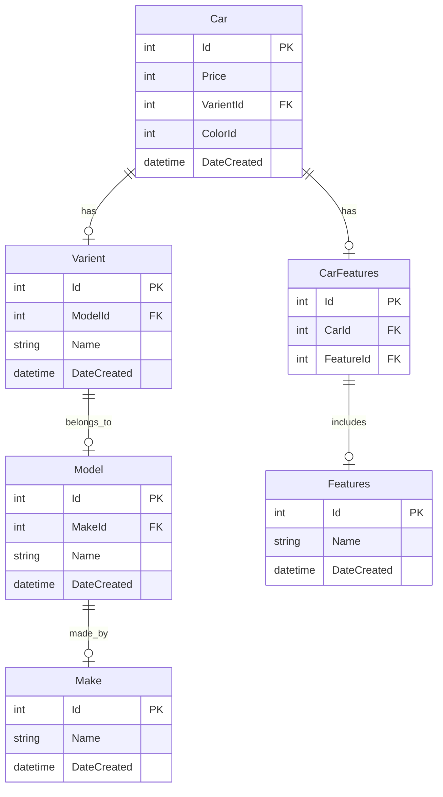
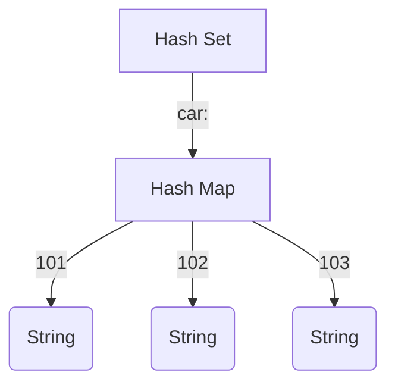
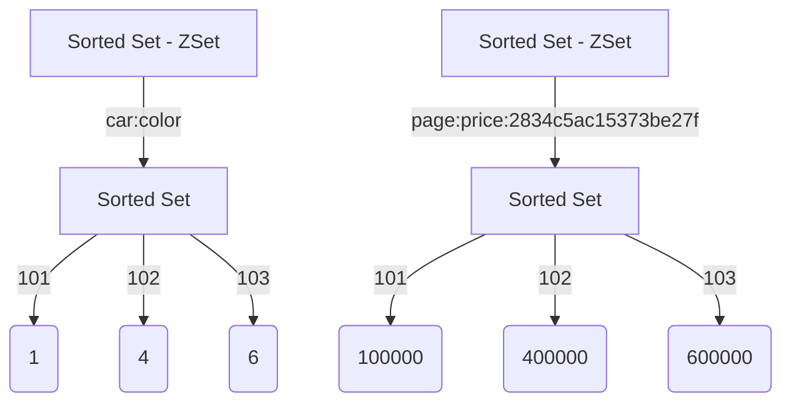
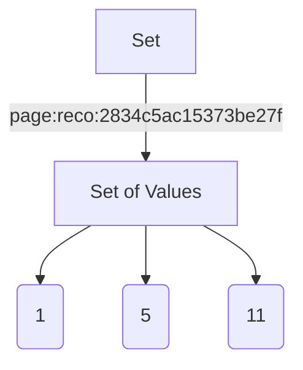

+++
title = "🏎️ Building pre-owned Car Platform With Valkey - Part 2"
description = "In Part 2, we will focus on building and optimizing the listing page using Valkey. We will explore how to handle complex filters, manage pagination efficiently, and ensure the listing page loads quickly to provide an excellent user experience."
date = 2024-07-17T19:54:52+05:30
lastmod = 2024-07-17T19:54:52+05:30
publishDate = "2024-07-17T19:54:52+05:30"
draft = false
tags = ['Django', 'Redis', 'DRF', 'CDC']
images = []
+++

In [Part 1](/posts/building-blazingly-fast-pre-owned-car-platform-with-valkey-part-1) of our series, we explored the foundational aspects of our platform's performance optimization. We began by defining our business model, which combines a marketplace and inventory system to facilitate car sales. We detailed the user flow, including how users view ads, generate leads, and book test drives. Our primary focus was on enhancing the performance of _individual car pages_, where we discussed various strategies to reduce latency and improve load times. We examined the impact of client-side versus server-side rendering and outlined initial approaches to optimizing both frontend and backend components.

In Part 2, we will focus on building and optimizing the listing page using Valkey. We will explore how to handle complex filters, manage pagination efficiently, and ensure the listing page loads quickly to provide an excellent user experience.

We will review the existing design and discuss how we mapped our business use cases to Valkey to significantly reduce response times. This will include an exploration of how to handle complex filters, manage pagination effectively, and leverage Valkey's capabilities to ensure that the listing page delivers a fast and seamless user experience.

# What ?

Listing Page - A catalog of cars with basic information and filter or order list of cars.

# Why ?

As we discussed in part-1, ~40-60% ads leads to listing page which shows list of cars. So we want to reduce page load time to reduce bounce rate.

# Specification

- Filters
- Pagination
- Recommendation Model

# Filters

In any ecommerece site, you have ability to filter the listing to narrow down what you are looking for. Here lets review how this works behind the scene using database.

## Database

### Schema

Car

| id  | price  | varient_id | color_id | date_created     |
| --- | ------ | ---------- | -------- | ---------------- |
| 1   | 775000 | 123        | 1        | 2020-07-20 02:17 |

Varient

| id  | model_id | name | date_created     |
| --- | -------- | ---- | ---------------- |
| 123 | 100      | XM   | 2020-07-20 02:17 |

Model

| id  | make_id | name  | date_created     |
| --- | ------- | ----- | ---------------- |
| 100 | 10      | Nexon | 2020-07-20 02:17 |

Make

| id  | name | date_created     |
| --- | ---- | ---------------- |
| 10  | Tata | 2020-07-20 02:17 |

Features

| id  | name | date_created     |
| --- | ---- | ---------------- |
| 20  | AMT  | 2020-07-20 02:17 |

CarFeatures

| id  | car_id | feature_id |
| --- | ------ | ---------- |
| 1   | 1      | 20         |



To simplify and address sufficient edge cases, we've explored a partial schema.

### Backend

In the backend, we are using [Django](https://www.djangoproject.com/) and [Django REST Framework](https://www.django-rest-framework.org/) to create REST APIs, alongside the [django-filter](https://django-filter.readthedocs.io/en/stable/guide/usage.html) library to easily add complex filters.

```py
from django_filters import rest_framework as filters

class CarFilterSet(filters.FilterSet):
    """Custom filter class for filtering cars"""
    city_id = filter.NumberFilter(name="locality__city__id", field_name="city_id", lookup_expr="in")
    price_min = django_filters.NumberFilter(name='price', lookup_expr='gte')
    price_max = django_filters.NumberFilter(name='price', lookup_expr='lte')
    make = django_filters.NumberFilter(name="varient__model__make__id", lookup_expr="in")
    model = django_filters.NumberFilter(name="varient__model__id", lookup_expr="in")
    color = django_filter.NumberFilter(name="color__id", lookup_expr="in")
    features = filter.NumberFilter(name='features__id', lookup_expr='in')
    slug = filter.SlugFilter()

    class Meta:
        model = Car
        fields = [
            "make",
            "model",
            "year",
            "color",
            "price",
            "slug"
        ]
```

In views.py, we define how to process the request. Here below viewset gets executed with each request where internally django will apply the filters to the queryset, paginate and serialize the objects into JSON response.

```py
from rest_framework import viewsets, mixins
from rest_framework.filters import OrderingFilter
from django_filters.rest_framework import DjangoFilterBackend
from .filters import CarFilterSet

class CarViewSet(viewsets.GenericViewSet, mixins.ListModelMixin):
    """
    A viewset that provides the standard actions for the User model,
    including filtering using CarFilterSet.
    """
    queryset = Car.objects.all() # django lazy queryset
    serializer_class = CarSerializer # converts django orm objects into json
    filter_backends = (DjangoFilterBackend, OrderingFilter) # django filters
    filterset_class = CarFilterSet # custom filterset
    ordering_fields = ["price", "year"]
    pagination_class = CarPagination

```

### Request

```sql
GET https://api.car.com/listing/?city_id=1&price_min=200000&price_max=400000&make_id=121,120&

SELECT ... FROM car
    LEFT JOIN locality on car.locality_id = locality.id
    LEFT JOIN city on locality.city_id = city.id
    LEFT JOIN varient on car.varient_id = varien t.id
    LEFT JOIN model on varient.model_id = model.id
    LEFT JOIN make on model.make_id = make.id
  WHERE
    city.id in (1,)
    AND car.price > 200000
    AND car.price < 400000
    AND make.id in (121, 120)
LIMIT 10 -- = page_size
OFFSET 0 -- = page_no * (page_size - 1) ; 1 <= page_no <= max_page
-- max_page = Math.ceil(count / page_size)
```

### Response

```json
HTTP 200 OK
{
  "count": 1023,
  "next": "https://api.car.com/listing/?page=3",
  "previous": "https://api.car.com/listing/?page=1",
  "results": [
    {
      "id": 1,
      "images": [
        "https://cdn.car.com/1/front.webp",
        "https://cdn.car.com/1/left.webp",
        "https://cdn.car.com/1/right.webp",
        "https://cdn.car.com/1/back.webp"
      ],
      "price": 721000,
      "model_name": "Nexon",
      "varient_name": "XM",
      "link": "/user-cars/1",
      "city_name": "Mumbai",
      "owner": "1st"
    }
    . . . = page_size cars
  ]
}
```

To improve SEO, we implemented dynamic slugs in our URLs, making them more human-friendly. For example, when someone searches for "Used Nexon car" on Google, our indexed page will already have a URL that reflects this search term. This approach enhances our search visibility and aligns our URLs with user queries, increasing the likelihood of attracting relevant traffic.

```sql
🌐 https://car.com/used-nexon-cars-in-mumbai
-- client takes path and sends as slug query param to the backend
GET https://api.car.com/listing/?slug=used-nexon-cars-in-mumbai
```

In this case, the `SlugFilter` will parse the tokens from the URL and use a database table to return the appropriate query string. For any given `SlugFilter`, a valid query string combination will always exist as it is a subset of the overall filters.

```md
user-nexon-cars-in-mumbai => model=121&city=1
```

| id  | value  | type      | filter |
| --- | ------ | --------- | ------ |
| 1   | nexon  | model     | 121    |
| 2   | mumbai | city      | 1      |
| 3   | 4-lakh | price     | 400000 |
| 4   | tata   | make      | 2      |
| 5   | petrol | fuel_type | 1      |

## ValKey

We will go through how to model the data in-memory. Let's go core data structures of ValKey for our usecase. We want ability to filter results and fetch details in minimum amount of round trip to ValKey[^1] with optimal space usage.

- Platform will have ~1000-5000 active cars.

### Why Use a Hash Set?

- To efficiently store car details that are shown in list responses.
- We can fetch data for multiple cars using `HMGET car: 101 102 103`. Based on the page size, we can supply a list of IDs to retrieve the JSON data.
- While we could store data in a key-value format like `car:101 -> JSON`, this approach would use additional memory for the `car:` prefix with each key. In contrast, HSET provides automatic compression for data up to a certain size.
- With a maximum page size of 35, we would fetch at most 35 car JSON objects via a single `HMGET` operation, optimizing data retrieval.

#### Invalidation

- As covered in part 1, we are listening to the database change log. Whenever any details of a car that affect the response payload change, we will update the Hash set.
- When a car's status changes to a terminal state, we will remove its key from the Hash set.



### Why Use a Sorted Set?

- While we could use `SORT list BY order`[^2], it is an expensive operation with a complexity of O(N+M*log(M)), where N is the number of elements in the list or set to sort, and M is the number of returned elements.
- Sorted sets allow us to efficiently filter car lists by attributes using set theory[^4]:
  - `ZRANGEBYSCORE car:price 100000 500000` retrieves cars with prices between 100K INR and 500K INR.
  - `ZRANGEBYSCORE car:color 5 5` fetches cars with color_id = 5.
  - These operations have a complexity of O(log(N)+M), where N is the number of elements in the sorted set and M is the number of elements returned.
- When the sort order is based on car attributes like price or date_added, we store the filtered sorted list in a sorted set and use it for pagination in subsequent requests. For example:
  - Key: `page:price:{queryhash}`, TTL: 10 minutes
  - In the best-case scenario, we can build the result page using a combination of the cached sorted set and hash set:
    1. `ZRANGE page:price:hash 11 20` (or `ZREVRANGE` for descending order)
    2. `HMGET car: 101 108 110 150 123 120 121 156 158 160`
    3. `ZCARD page:price:hash` to get the count of cars

This approach optimizes data retrieval and filtering operations, improving overall performance. Here note that for any buyer sort order for given query will always stay the same as it depends only on car information.



### Why Set ?

When the sort order is based on recommendations, the order of cars changes according to the buyer's persona. We used to train our recommendation model every 45 minutes, which means the order of cars can also change at this interval.

To optimize this process

- We calculate the query hash using only car-related filters as function inputs.
- This approach is particularly beneficial when most buyers are viewing base pages, such as cars available in Mumbai city.

By using a Set, we ignore the order of cars, as it is calculated at runtime by the LightFM model pre-loaded in the web server's memory. This approach offers several advantages:

- It avoids storing N (where N is the size of the user base) possible combinations of car orders for broad queries, such as "cars available in Mumbai city."
- It reduces storage requirements and simplifies data management in Valkey.
- It allows for real-time personalization without the need to pre-compute and store multiple versions of ordered lists.

This method efficiently handles personalized recommendations while minimizing storage overhead, especially for popular, broad queries that many users might access simultaneously. The Set stores only the relevant car IDs, while the web server handles the personalized ordering, creating a scalable and responsive system for serving car listings.



#### Cache-Hit

1. Fetch filtered car set
2. Supply it to recommendation engine
3. Paginate (at application via list comprehension)
4. Fetch car details via `HMGET`

### Cache-Miss

In case we don't have list of cars cached in sorted set or set post query hash calculation, we need to build those set in this case.

1. Calculate query string hash, with property of `F('city_id=1&color=3,4') eq F('color=4,3&city_id=1')`
2. Cache-Miss
3. Using combination of set operations build target set with filters

- `ZINTERSTORE` - Stores the intersection of multiple sorted sets in a key.
- `ZUNIONSTORE` - Stores the union of multiple sorted sets in a key.

4. `ZRANGEBYSCORE` - fetch car ids based on required order.

In certain cases at application (web server) we did the set operations to compute the resulting list of cars.

```py
def filter_by_price(redis_pipe, price_min='-inf', price_max='+inf'):
    return redis_pipe.zrangebyscore(
        name="car:price",
        min=min_value,
        max=max_value
    )
```

#### Dealing with many-to-many relationship

In case you have noticed we have Features table with MxN relationship with Cars table via CarFeatures. As one car can have many features and one feature could be there with multiple cars. How are we filtering here ?

In such cases, instead of going with `car:color` sorted set, we keep sorted set of each feature, `car:feature:{id} -> {car_id} -> 1`

Now we can use intersection and union on these sets to compute the filter.

#### Reducing network round trips

Valkey pipelining[^3] is a technique for improving performance by issuing multiple commands at once without waiting for the response to each individual command.

Pipelining is not just a way to reduce the latency cost associated with the round trip time, it actually greatly improves the number of operations you can perform per second in a given Valkey server. This is because without using pipelining, serving each command is very cheap from the point of view of accessing the data structures and producing the reply, but it is very costly from the point of view of doing the socket I/O. This involves calling the read() and write() syscall, that means going from user land to kernel land. The context switch is a huge speed penalty.

When pipelining is used, many commands are usually read with a single read() system call, and multiple replies are delivered with a single write() system call. Consequently, the number of total queries performed per second initially increases almost linearly with longer pipelines, and eventually reaches 10 times the baseline obtained without pipelining.

We utilised the pipelining method to reduce round trips on Cache-Miss.

# Result

- We can horizontally scale valkey read-replicas to serve the read traffic.

[^1]: 

| Command         | Description                                                                                             |
| --------------- | ------------------------------------------------------------------------------------------------------- |
| `SET`           | Sets the string value of a key, ignoring its type. The key is created if it doesn't exist.              |
| `TTL`           | Returns the expiration time in seconds of a key.                                                        |
| `HMSET`         | Sets the values of multiple fields.                                                                     |
| `HMGET`         | Returns the values of all fields in a hash.                                                             |
| `HGETALL`       | Returns all fields and values in a hash.                                                                |
| `SADD`          | Adds one or more members to a set. Creates the key if it doesn't exist.                                 |
| `SCARD`         | Returns the number of members in a set.                                                                 |
| `SINTER`        | Returns the intersection of multiple sets.                                                              |
| `SINTERSTORE`   | Stores the intersection of multiple sets in a key.                                                      |
| `SISMEMBER`     | Determines whether a member belongs to a set.                                                           |
| `SUNION`        | Returns the union of multiple sets.                                                                     |
| `SUNIONSTORE`   | Stores the union of multiple sets in a key.                                                             |
| `ZADD`          | Adds one or more members to a sorted set, or updates their scores. Creates the key if it doesn't exist. |
| `ZCARD`         | Returns the number of members in a sorted set.                                                          |
| `ZCOUNT`        | Returns the count of members in a sorted set that have scores within a range.                           |
| `ZDIFFSTORE`    | Stores the difference of multiple sorted sets in a key.                                                 |
| `ZINTERSTORE`   | Stores the intersection of multiple sorted sets in a key.                                               |
| `ZMSCORE`       | Returns the score of one or more members in a sorted set.                                               |
| `ZRANGE`        | Returns members in a sorted set within a range of indexes.                                              |
| `ZRANGEBYSCORE` | Returns members in a sorted set within a range of scores.                                               |
| `ZRANGESTORE`   | Stores a range of members from a sorted set in a key.                                                   |
| `ZRANK`         | Returns the index of a member in a sorted set ordered by ascending scores.                              |
| `ZREM`          | Removes one or more members from a sorted set. Deletes the sorted set if all members were removed.      |
| `ZSCAN`         | Iterates over members and scores of a sorted set.                                                       |
| `ZSCORE`        | Returns the score of a member in a sorted set.                                                          |
| `ZUNION`        | Returns the union of multiple sorted sets.                                                              |
| `ZUNIONSTORE`   | Stores the union of multiple sorted sets in a key.                                                      |


[^2]: <https://valkey.io/commands/sort/>
[^3]: <https://valkey.io/topics/pipelining/>
[^4]: <https://en.wikipedia.org/wiki/Set_theory>
